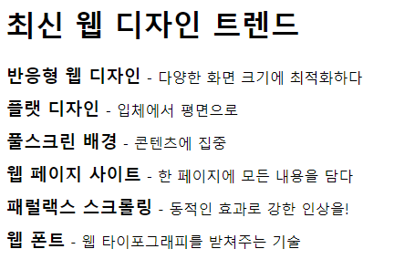
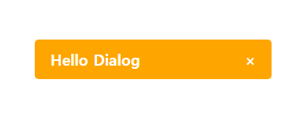
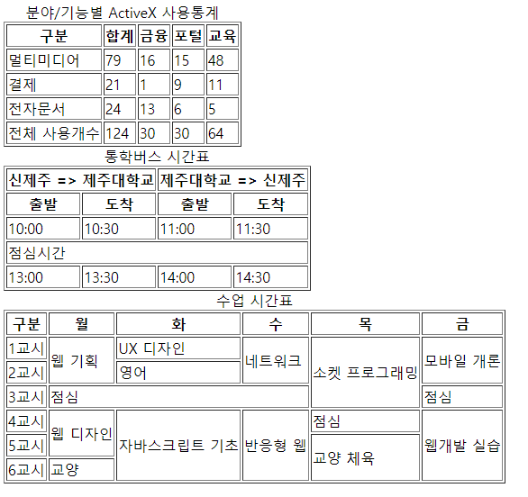

## 기초웹개발론

### HTML, CSS Markup

-   기초웹
    -   IntelliJ 설치법 & 학생 라이센스
    -   IntelliJ 단축키
    -   Web Design Trend
    -   Hello Dialog Box
    -   Tables

> IntelliJ 설치법 & 학생 라이센스

```
    ./install_intellij/install_intellij.html
    ./install_intellij/style.css
```

<center>  </center>

> IntelliJ 단축키

```
    ./shortcut/shortcut.html
    ./shortcut/style.css
    ./shortcut/reset.css
```

<center>  </center>

> Web Design Trend

```
    ./Design_Trend/Design_Trend.html
```

<center>  </center>

> Hello Dialog Box

```
    ./Hello_DialogBox/Hello_Dialog_Box.html
```

<center>  </center>

> Tables

```
    ./Table_HTML/Table.html
```

<center>  </center>
