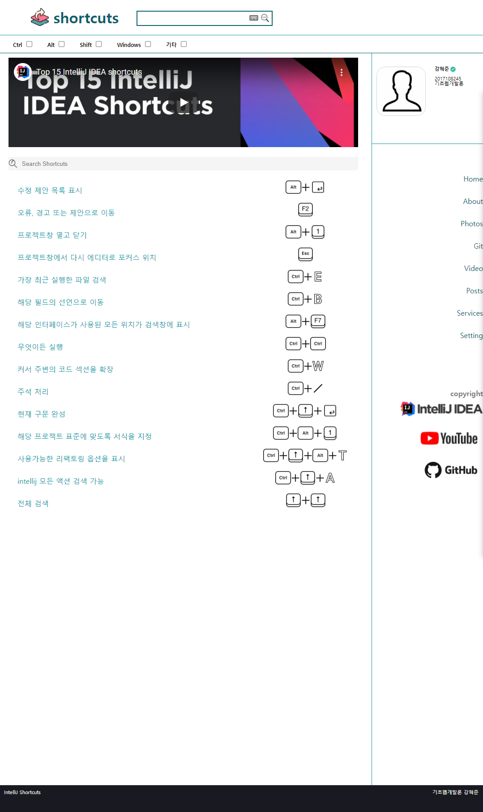

## 기초웹개발론

> HTML, CSS Markup

-   기초웹
    -   IntelliJ 설치법 & 학생 라이센스
    -   IntelliJ 단축키

> IntelliJ 설치법 & 학생 라이센스

```
    ./install_intellij/install_intellij.html
    ./install_intellij/style.css
```


> IntelliJ 단축키

```
    ./shortcut/shortcut.html
    ./shortcut/style.css
    ./shortcut/reset.css
```


